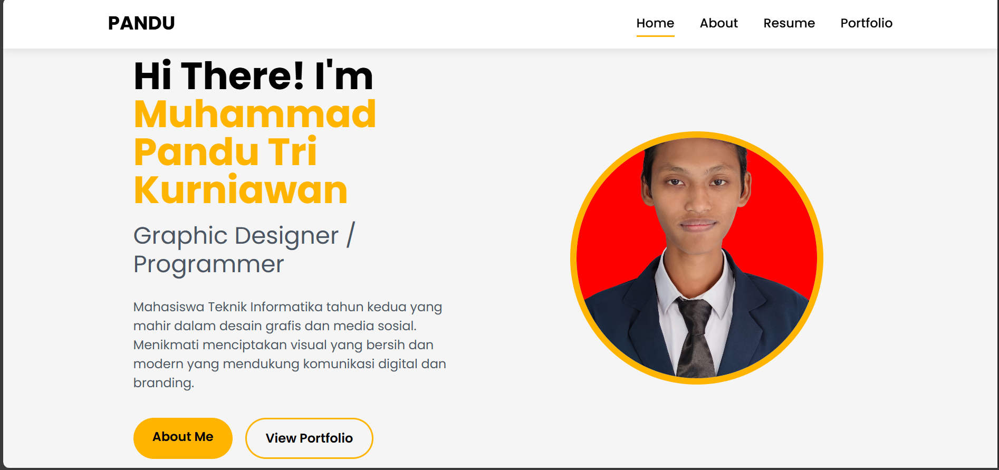
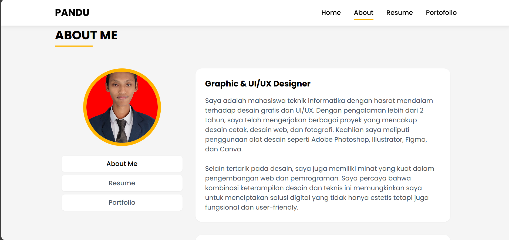
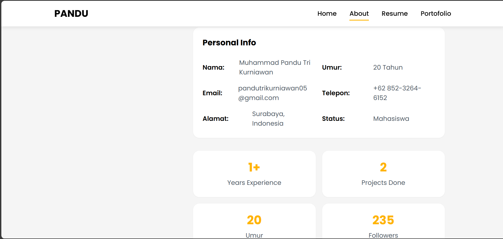
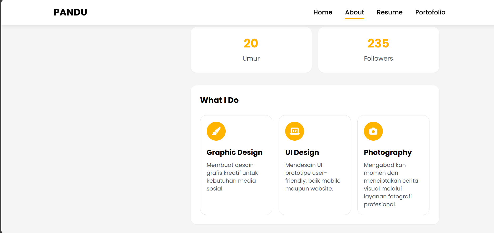
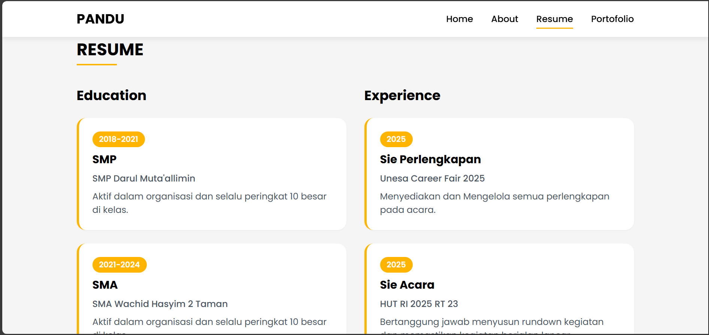
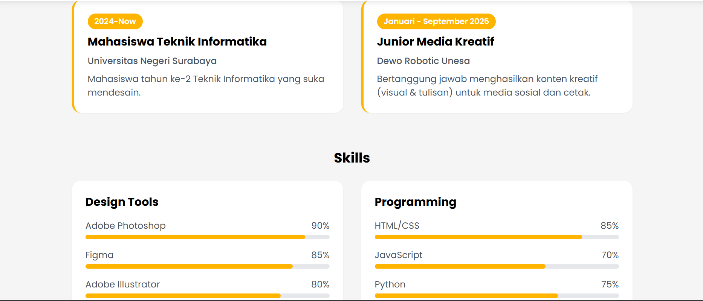
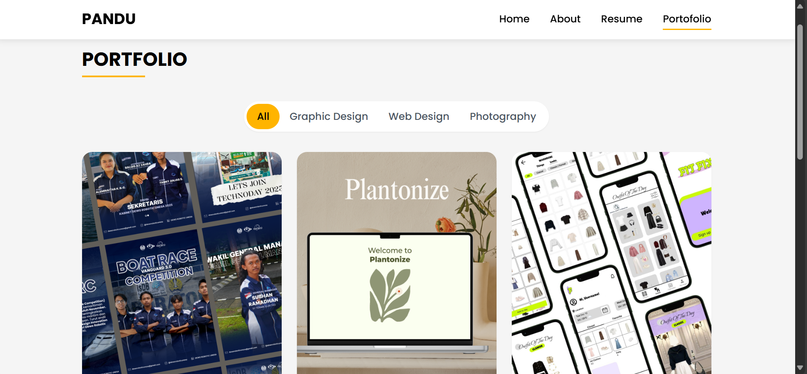
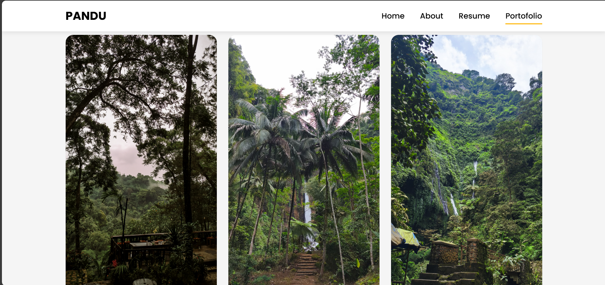
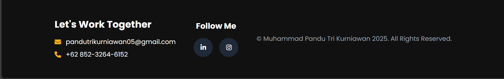

# portofolio
Website portofolio ini merupakan proyek pribadi yang dibuat oleh Muhammad Pandu Tri Kurniawan untuk memenuhi tugas project mandiri dari mata kuliah Pemrograman Berbasis Platform.

Program ini dibangun menggunakan teknologi HTML5, Tailwind CSS, dan JavaScript (Vanilla JS). HTML berperan sebagai struktur utama halaman, Tailwind CSS digunakan untuk mempercantik tampilan dengan gaya desain utility-first yang responsif, sedangkan JavaScript digunakan untuk menambahkan elemen interaktif seperti navigasi aktif, menu mobile, dan sistem filter pada halaman portofolio. Selain itu, website ini juga memanfaatkan Font Awesome untuk ikon dan Google Fonts (Poppins) untuk memperindah tipografi.

Struktur website ini terdiri dari empat file utama, yaitu index.html, about.html, resume.html, dan portofolio.html, serta sebuah folder image/ yang berisi file gambar seperti foto profil dan gambar karya desain maupun fotografi. Setiap halaman memiliki struktur layout yang konsisten dengan komponen navbar di bagian atas dan footer di bagian bawah, sehingga navigasi antarhalaman terasa menyatu dan mudah digunakan.

berikut hasil dari web saya

